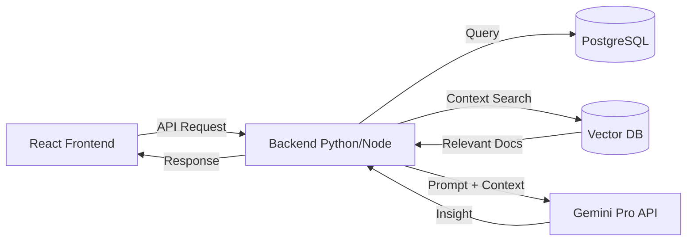

# Arquitectura Técnica: IKUSI Service (MVP vs Producción)

## 1. Estado Actual (MVP / Demo Local)
Para fines de esta demostración rápida y autónoma, la aplicación **no tiene dependencias externas**. Todo corre 100% en el navegador del cliente.

*   **Modelo de IA (LLM)**: **Simulado (Heurística Determinista)**.
    *   *Implementación*: Motor de reglas Javascript en `src/components/layout/AIAssistant.jsx`.
    *   *Lógica*: Busca palabras clave (regex) en el título/descripción y mapea respuestas predefinidas para simular análisis.
*   **Base de Datos**: **LocalStorage (Navegador)**.
    *   *Implementación*: `Zustand` con middleware `persist`.
    *   *Persistencia*: Los datos viven en la memoria del navegador del usuario. Si borras caché, se reinicia.
*   **Backend / API**: **Serverless (Cliente)**.
    *   No hay servidor backend. La lógica de negocio está en los Hooks de React.

---

## 2. Arquitectura Recomendada para Producción (Hacia el Futuro)
Para llevar esto a un entorno empresarial real, esta sería la arquitectura de referencia:

### A. Capa de Inteligencia Artificial (Flash 2.0 Real)
*   **Modelo (LLM)**: **Google Gemini 1.5 Pro** o **GPT-4o**.
    *   *Por qué*: Ventana de contexto amplia para analizar logs extensos y múltiples tickets históricos a la vez.
*   **Integración**: Framework **LangChain** o **LlamaIndex**.
    *   *RAG (Retrieval Augmented Generation)*: Conectar el LLM a una Base de Conocimiento (Archivos PDF, Confluence) para que las respuestas se basen en la documentación real de la empresa, no solo en su entrenamiento base.

### B. Capa de Datos (Persistencia)
*   **Base de Datos Relacional**: **PostgreSQL** (ej: Supabase, AWS RDS).
    *   Para datos estructurados: Incidentes, Usuarios, CMDB.
*   **Base de Datos Vectorial**: **Pinecone** o **pgvector**.
    *   Para "Embeddings" de tickets pasados. Esto permite a la IA decir: *"Este incidente se parece al Ticket-504 resuelto hace 3 meses por Juan Pérez"*.

### C. Backend (API Gateway)
*   **Tecnología**: **Python (FastAPI)** o **Node.js (NestJS)**.
*   **Función**:
    1.  Recibe la petición del Frontend.
    2.  Consulta la Base de Datos (Contexto).
    3.  Construye el Prompt con contexto RAG.
    4.  Llama al API del LLM (Gemini/OpenAI).
    5.  Devuelve la respuesta estructurada al Frontend.

### Diagrama de Flujo (Propuesto)

